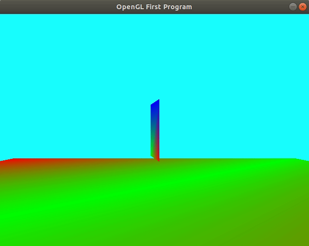
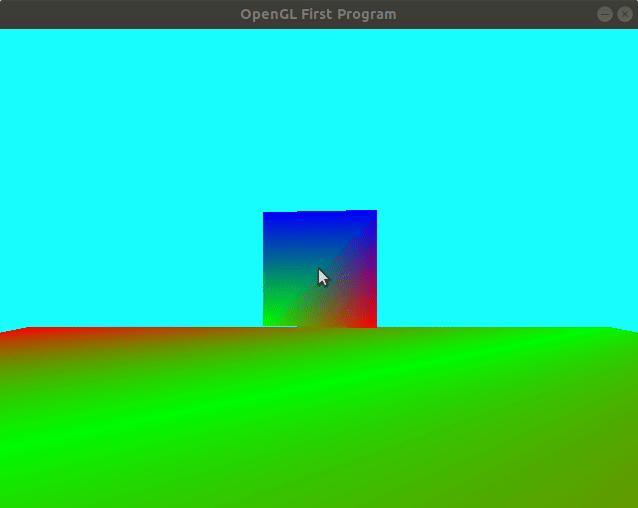

# Part 1 - Rotation, Camera, and the MVP Matrix

> "Local/object space -> world space -> view/Camera space --> View Volume(i.e. Projection) --> Screen Space"



# Logistics

- You may use whatever operating system, IDE, or tools for completing this lab/assignment.
	- However, my instructions will usually be using the command-line, and that is what I will most easily be able to assist you with.
- In the future there may be restrictions, so please review the logistics each time.

**For this Lab/Assignment**: You will be working on your own laptop/desktop machine. Historically, the setup is the most difficult part of the assignment, because supporting multiple architectures and operating systems can be tricky. Nevertheless, we will get through it!
# Resources to Help

Some additional resources to help you through this lab assignment

| SDL2 related links                                    | Description                       |
| --------------------------------------------------    | --------------------------------- |
| [SDL API Wiki](https://wiki.libsdl.org/APIByCategory) | Useful guide to all things SDL2   |
| [My SDL2 Youtube Playlist](https://www.youtube.com/playlist?list=PLvv0ScY6vfd-p1gSnbQhY7vMe2rng0IL0) | My Guide for using SDL2 in video form.   |
| [Lazy Foo](http://lazyfoo.net/tutorials/SDL/)         | Great page with written tutorials for learning SDL2. Helpful setup tutorials for each platform. |
| [Lazy Foo - Handling Key Presses](https://lazyfoo.net/tutorials/SDL/04_key_presses/index.php) | Useful tutorial for learning how to handle key presses | 

| OpenGL related links                                | Description                       |
| --------------------------------------------------  | --------------------------------- |
| [My OpenGL Youtube Series](https://www.youtube.com/playlist?list=PLvv0ScY6vfd9zlZkIIqGDeG5TUWswkMox) | My video series for learning OpenGL |
| [docs.gl](http://docs.gl)                           | Excellent documentation to search for OpenGL commands with examples and description of function parameters   |
| [learnopengl.com](https://learnopengl.com)          | OpenGL 3.3+ related tutorial and main free written resource for the course   |


| C++ related links                                   | Description                       |
| --------------------------------------------------  | --------------------------------- |
| [My C++ Youtube Series](https://www.youtube.com/playlist?list=PLvv0ScY6vfd8j-tlhYVPYgiIyXduu6m-L) | My video series playlist for learning C++ |
| [cppreference](https://en.cppreference.com/w/)      | Definitive, more encyclopedic guide to C++ (less beginner focused, but excellent technically) |
| [cplusplus.com](http://www.cplusplus.com)           | Nice website with examples and tutorials geared more for beginners, reference has lots of examples, and the tutorial page is a great starting point |
| [learncpp.com](https://www.learncpp.com/)           | Handy page for learning C++ in tutorial form   |


# Description

Previously you have rendered a colored triangle and understood how to pass data through the graphics pipeline from the application (CPU) and then from vertex shader (GPU) to fragment shader (GPU). In this assignment we are going to focus on the transformation of 3D objects through the 'Transform' step performed in the vertex shader.

## Task 1 - Rotation

For this task you are going to work on the following task(s):

1. You will be creating a rotation of a quad by setting up a 'model matrix'
2. You will be creating a perspective camera.

- **Note:** You will find in the code "TODO" sections in the [./src/main.cpp](./src/main.cpp) for this task.
- **Note:** A word to the wise might be to read through this tutorial first: http://www.opengl-tutorial.org/beginners-tutorials/tutorial-3-matrices/

### Introduction

In order to setup the 'model matrix' the first thing you need to understand is how to pass data from the CPU to the GPU.

### glUniform

[glUniforms](https://docs.gl/gl4/glUniform) are our tools for passing data between CPU and GPU. When you setup a glUniform you are effectively binding a value from the CPU onto the GPU. This value can be updated once per glDraw* call. Once the value is uploaded to the GPU, it cannot be changed (i.e. you cannot re-assign the value in any of the shader code.). Once uniform variables are on the GPU however, they are globally accessible. This can be useful if you need to use them in multiple stages in the pipeline.

Note: One other important detail about variables is that they **must** match the name in the shader when you specify them on the CPU side.

### Setting up Uniforms on the CPU

The following is an example of how you might setup a uniform variable for your model matrix. 

- Again, observe the 'u_ModelMatrix' must match exactly the code in your shader.
- Observe I tend to prefix any variable related to uniforms with 'u'.

```c
      // Retrieve our location of our Model Matrix
    GLint u_ModelMatrixLocation = glGetUniformLocation( gGraphicsPipelineShaderProgram,"u_ModelMatrix");

    if(u_ModelMatrixLocation >=0){
        glUniformMatrix4fv(u_ModelMatrixLocation,1,GL_FALSE,&model[0][0]);
    }else{
        std::cout << "Could not find u_ModelMatrix, maybe a mispelling?\n";
        exit(EXIT_FAILURE);
    }
```

### Using uniforms in the GLSL

In your vertex shader, you will need to make use of the uniform variables:

- u_Projection
- u_ViewMatrix
- u_ModelMatrix

Consider how you can use those variables to transform the original `vec4(position,1.0f);` (and consider the order you apply them in)

### Other notes

- Q: Is the starter code supposed to compile?
	- A: Yes
- Q: No it does not, you are lying. Are you sure?
	- A: Yes it does. But you probably do not see anything and the program crashes.
- Q: Okay, why?
	- A: `    model           = glm::rotate(model,glm::radians(g_uRotate),glm::vec3(0.0f,1.0f,0.0f));`
 	-  It's not enough to setup the model matrix. We need to send it to the shader.
  	-  The error you are probably receiving is from glsl stating that it cannot find a variable.
  	-  Set up the uniform based on the code snippet above (You'll need to do the same for the perspective and camera(view) as well) .
	- Read this (or all of the provided code) and look at the uniforms: http://www.opengl-tutorial.org/beginners-tutorials/tutorial-3-matrices/   	


## Task 2 - Camera



### Introduction

For this next portion of the assignment, you are going to be creating a 'camera'. Provided is a [./src/Camera.cpp](./src/Camera.cpp) with some TODO items to fill in. When you have completed the camera you will be able to:

1. Move forward, backwards, left, and right with the <kbd>w</kbd>,<kbd>a</kbd>,<kbd>s</kbd>, and <kbd>d</kbd> keys.
2. Be able to perform a 'mouselook' along the y-axis. 

The image to the right shows an example of the completed assignment and the camera moving.

For this task you will be filling in the [./src/Camera.cpp](./src/Camera.cpp)

### Some notes on camera

- The first vector you are going to want to get right is the view direction.
- The view direction vector is rotating about the y-axis for this assignment (i.e. you can turn your head on the y-axis only).
	- Note: The 'mouse cursor' is hidden in this assignment (Search: 'SDL_WarpMouseInWindow' and 'SDL_SetRelativeMouseMode' for more information)
   	- Note: You can press 'ESC' key to exit (otherwise tab out of the application to gain control and exit the window). 
- When your mouse look is working then proceed to complete the direction move commands.
	-  Note: that it is not enough to just add +1 or -1 on moving forward or backward along the z-axis for example.
 	-  You need to compute a new x,y,z axis for your camera.
  		- Up in the world is always (0,1,0) -- this is the upVector
    		- You have the 'viewDirection' computed from your moues look.
      		- So think about how we can compute the vector that points to the right (the rightVector) using a handy mathematical tool we have learned about.
        	- When you have this rightVector and your viewDirection, think about how those vectors correspond to moving forward, backwards, left, and right.

# Submission/Deliverables

### Submission

- Commit all of your files to github, including any additional files you create.
- Do not commit any binary files unless told to do so.
- Do not commit any 'data' files generated when executing a binary.

### Deliverables

1. A rotating Quad
2. A camera where you can move
3. A camera where you can mouselook around the y-axis

# F.A.Q. (Instructor Anticipated Questions)

1. Q: I don't understand where to start?
	- A: Start slowly by implementing the rotation
2. Q: My camera is not working?
	- A: You have to think about the camera. This is where that vector math becomes useful.
 	- A: Are your cross products reversed?
3. Q: Should I normalize my vectors in my camera?
	- A: Yes. You can scale how much you move or the rate in your camera by 'speed'
4. Q: How do I debug my camera?
   	- A: Print out your vectors.
   	- A: Another option, draw a line (stretch it to be very large) for any axis (or all of them).
5. Q: My uniform is in my shader, and I think I've got the uniform location on my cpu but it's not working?
	- A: If you don't use a uniform in your GPU, then it may get optimized out. You need to actually use it in your code (i.e. perform some 'read' (i.e. an access, because uniforms are read-only)) operation of the uniform variable.

# Going Further

What is that, you finished early? Did you enjoy this lab? Here are some (optional) ways to further this assignment.

- Move your triangle with the arrow keys
- Try changing the colors of the triangle slowly over time.

# Found a bug?

If you found a mistake (big or small, including spelling mistakes) in this lab, kindly send me an e-mail. It is not seen as nitpicky, but appreciated! (Or rather, future generations of students will appreciate it!)

- Fun fact: The famous computer scientist Donald Knuth would pay folks one $2.56 for errors in his published works. [[source](https://en.wikipedia.org/wiki/Knuth_reward_check)]
- Unfortunately, there is no monetary reward in this course :)
